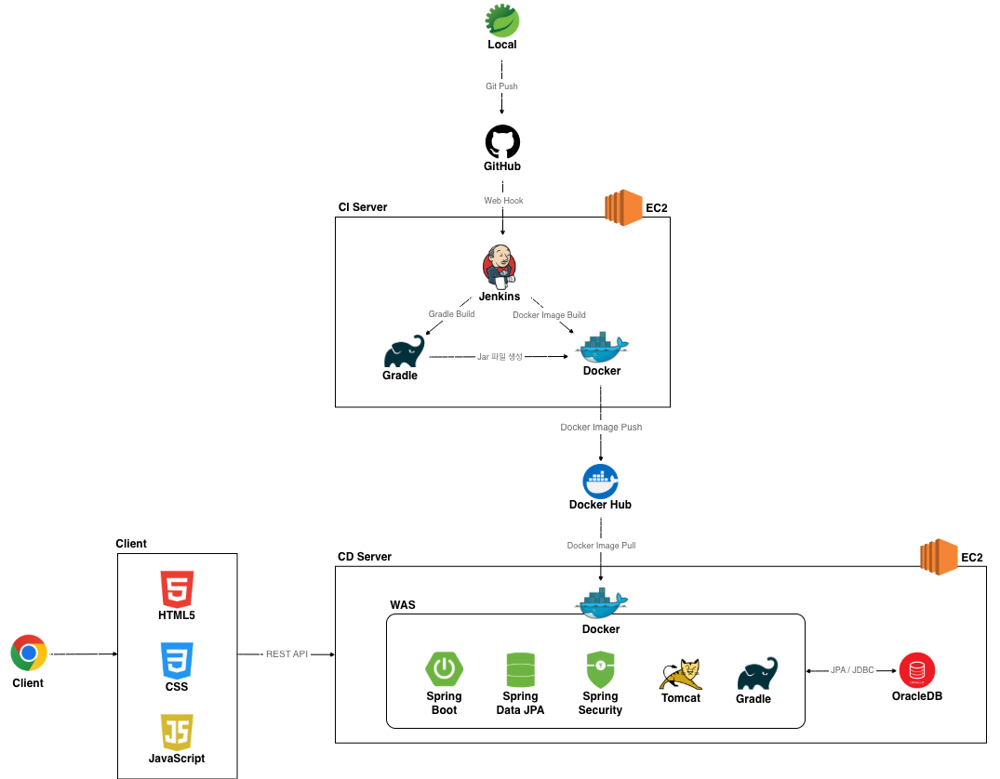

<a id="readme-top"></a>

<!-- 프로젝트 로고 -->
<div align="center">
  
  <h3 align="center">집밥의민족</h3>
  <p align="center">
    집밥 레시피 공유 웹사이트
    <br />
    <a href="http://ec2-15-164-104-202.ap-northeast-2.compute.amazonaws.com:8586"><strong>웹사이트 바로가기 »</strong></a>
    <br />
    <br />
    <a href="https://github.com/othneildrew/Best-README-Template">API 명세</a>
    &middot;
    <a href="https://github.com/yum-recipe-project/zipmin/wiki">개발 노트</a>
  </p>
</div>

<!-- TODO : 이곳에 목차 만들기 -->


<br/><br/><br/>

## 1. 프로젝트 정보

### 1.1&nbsp;&nbsp;프로젝트 개요

집밥의민족은 레시피를 공유하고 요리 경험을 나누는 **레시피 커뮤니티 웹사이트**입니다.<br/>
요리에 익숙하지 않아도 부담 없이 집밥을 요리하도록 돕기 위한 목적에서 출발하였습니다.

다양한 검색 기능으로 레시피를 쉽게 찾고 장보기 메모와 냉장고 파먹기로 편리하게 요리를 준비합니다.<br/>
쩝쩝박사에서는 요리에 대한 다양한 주제로 소통하고, 키친가이드와 쿠킹클래스에서 주방 꿀팁을 배우고 요리 경험을 나눕니다.<br/>
집밥의민족은 단순한 레시피 공유를 넘어 일상 속 식습관과 요리 문화를 함께 만들어가는 공간입니다.

**집밥의민족은 다음과 같은 주요 기능들을 제공합니다.**

1. 다양한 검색 기능으로 레시피를 쉽게 찾아 댓글과 리뷰를 남기고 후원할 수 있습니다.
2. 쩝쩝박사에서는 재미있는 투표와 매거진을 통해 요리 트렌드와 음식 취향에 대한 이야기를 나누고 유쾌한 설전을 벌입니다.
3. 키친가이드와 쿠킹클래스로 주방 꿀팁과 조리법을 배울 수 있습니다.
4. 장보기 메모와 냉장고 파먹기 그리고 지도 기능으로 주변 마트를 찾고 냉장고 속 재료를 관리할 수 있습니다.

**이제 <a href="http://ec2-15-164-104-202.ap-northeast-2.compute.amazonaws.com:8586">여기를 클릭하여</a> 집밥의민족을 시작해보세요!**

<br/><br/>

### 1.2&nbsp;&nbsp;배포 정보

**[🌐 웹사이트 바로가기](http://ec2-15-164-104-202.ap-northeast-2.compute.amazonaws.com:8586)**
* 일반사용자 : harim / 1234
* 일반사용자 : dayeong / 1234

**[🌐 관리자사이트 바로가기](http://ec2-15-164-104-202.ap-northeast-2.compute.amazonaws.com:8586/admin/login.do)**
* 총관리자 : admin / 1234
* 관리자 : admin1 / 1234

<br/><br/>

### 1.3&nbsp;&nbsp;개발 정보

**프로젝트 기간**
* 1차 개발 기간 : 2025.02.07 – 04.20
* 2차 개발 기간 : 2025.07.01 - 10.25
* 운영 기간 : 2025.11.10 - 진행중 (현재 Docker와 Jenkins 기반 배포 환경 구축 준비중)

**개발 인원**
* 총 2명 (풀스택)

**주요 기술**
* Backend : Java, Spring Boot, Spring Data JPA, Spring Security
* Frontend : HTML, CSS, Javascript
* Database : Oracle
* DevOps : Linux, Tomcat, Docker, Jenkins, AWS EC2

<br/><br/><br/>

## 2. 주요 기능

### 2.1&nbsp;&nbsp;주요 기능

#### 홈

* 시간대에 따라 룰렛으로 랜덤 메뉴 추천
* 상단 배너에서 추천 키친가이드 게시글 자동 순환
* 최신·인기 레시피 등 카테고리별 랭킹 조회

#### 인증 및 회원 관리

* 자체 로그인 및 소셜 로그인 지원
* Spring Security 기반 인증 및 인가와 JWT 기반 토큰 관리
* 회원가입 및 로그인과 회원정보 수정을 포함한 계정 관리
* SMTP로 이메일 인증 및 링크 전송을 통한 비밀번호 재설정
* AJAX 비동기 방식으로 사용자 중복 검사와 닉네임 랜덤 추천

#### 레시피

* 검색창·카테고리·정렬을 포함한 레시피 목록 검색
* 레시피 작성 및 레시피 관리
* 제목·소개·난이도·조리시간·맵기 등 레시피 상세 정보 표시
* 인분 수에 따른 재료량 자동 조정 및 장보기 메모 담기 기능 지원
* 리뷰·댓글·스크랩·신고·인쇄·후원·팔로우 등 다양한 사용자 상호작용

#### 키친가이드

* 손질법과 보관법 등 주방 정보를 제공하는 게시판
* 검색창·카테고리·정렬을 포함한 키친가이드 목록 검색과 스크랩 기능 지원
* 관리자의 게시글 작성 및 사용자의 댓글 기능 지원

#### 쩝쩝박사

* 음식 관련 투표·매거진·이벤트 등 참여형 콘텐츠를 제공하는 게시판
* 검색창·카테고리·정렬을 포함한 쩝쩝박사 목록 검색
* 관리자의 게시글 작성 및 사용자의 댓글 기능 지원

#### 쿠킹클래스

* 사용자가 클래스 개설을 신청하면 관리자의 승인 후 개설
* 신청서 작성과 신청자 선정 및 출석 체크 등 쿠킹클래스 운영 기능 지원
* 3회 이상 결석 시 마지막 신청일 기준 3개월 신청 제한 적용
* 검색창·카테고리·정렬·상태 필터를 포함한 클래스 목록 조회
* 준비물·일정·장소·커리큘럼·강사 정보 등 클래스 상세 정보 표시
* 마이페이지에서 개설·신청 클래스 관리

#### 후원

* PortOne 결제 연동으로 포인트 충전 후 레시피 후원
* 출금 계좌를 등록하고 관리
* 출금 신청 후 관리자 출금 처리 및 내역 조회

#### 나의 냉장고

* 식재료를 등록·관리하고 나의 냉장고에 등록
* 냉장고 속 재료 기반 요리 추천 및 일치율 표시
* 장보기 메모 작성 후 장보기 완료 시 재료를 냉장고에 자동 등록
* KakaoMap을 활용한 주변 마트 위치 안내

#### 관리자

* 사용자 계정 조회 및 관리
* 출금 신청 승인 및 정산 내역 관리
* 레시피·클래스·키친가이드·쩝쩝박사 등 게시판 관리
* 쿠킹클래스 승인 및 관리

<br/><br/>

### 2.2 화면 설계

<details>
  <summary>&nbsp;공통 컴포넌트</summary>
  <p align="center">
    
    
    
  </p>
  <p align="center">
    
    
    
  </p>
  <p align="center">
    
    
  </p>
</details>
  <details>
<summary>&nbsp;회원 화면</summary>
    <p align="center"> 
        
      
        
    </p>
</details>
<details>
<summary>&nbsp;레시피 화면</summary>
  <p align="center"> 
      
      
      
  </p>
</details>
<details>
  <summary>&nbsp;키친가이드 화면</summary>
  <p align="center"> 
      
      
  </p>
</details>
<details>
  <summary>&nbsp;쩝쩝박사 화면</summary>
  <p align="center"> 
      
      
      
  </p>
</details>
<details>
  <summary>&nbsp;쿠킹클래스 화면</summary>
  <p align="center"> 
      
      
      
  </p>
  <p align="center"> 
    
      
        
  </p>
</details>
<details>
  <summary>&nbsp;후원 화면</summary>
  <p align="center"> 
      
      
      
  </p>
</details>
<details>
  <summary>&nbsp;나의 냉장고 화면</summary>
  <p align="center"> 
      
      
      
  </p>
</details>
<details>
  <summary>&nbsp;관리자 화면</summary>
  <p align="center"> 
      
      
      
  </p>
</details>

<br/><br/><br/>

## 3. 프로젝트 설계

### 3.1 사용 기술

|구분 | 사용 기술 |
|:--:|--|
| **Frontend** | HTML5&nbsp;&nbsp;·&nbsp;&nbsp;CSS3&nbsp;&nbsp;·&nbsp;&nbsp;JavaScript&nbsp;&nbsp;·&nbsp;&nbsp;Bootstrap 5.3.3&nbsp;&nbsp;·&nbsp;&nbsp;KakaoMap API |
| **Backend** | Java 21&nbsp;&nbsp;·&nbsp;&nbsp;Spring Boot 3.0.3&nbsp;&nbsp;·&nbsp;&nbsp;Spring Data JPA&nbsp;&nbsp;·&nbsp;&nbsp;Spring Security&nbsp;&nbsp;·&nbsp;&nbsp;JWT&nbsp;&nbsp;·&nbsp;&nbsp;Mapstruct |
| **Database** | Oracle 21C |
| **Infrastructure** | Linux&nbsp;&nbsp;·&nbsp;&nbsp;Apache Tomcat 10.1.46&nbsp;&nbsp;·&nbsp;&nbsp;Docker&nbsp;&nbsp;·&nbsp;&nbsp;Jenkins&nbsp;&nbsp;·&nbsp;&nbsp;AWS EC2 |
| **Tools** | STS 4&nbsp;&nbsp;·&nbsp;&nbsp;GitHub&nbsp;&nbsp;·&nbsp;&nbsp;Figma&nbsp;&nbsp;·&nbsp;&nbsp;Swagger&nbsp;&nbsp;·&nbsp;&nbsp;Postman&nbsp;&nbsp;·&nbsp;&nbsp;SQL Developer&nbsp;&nbsp;·&nbsp;&nbsp;Slack |
| **Etc.** | PortOne&nbsp;&nbsp;·&nbsp;&nbsp;SMTP |

<br/><br/>

### 3.2 아키텍처

집밥의민족 프로젝트는 다음과 같이 설계했습니다.



<br/>

### 3.3 프로젝트 구조

집밥의민족 프로젝트는 <b>계층형 구조</b>를 도입하여 비즈니스 로직과 데이터 접근을 명확히 분리하여 개발되었습니다. 계층형 구조를 도입한 이유는 다음과 같습니다.

<ol>
  <li>계층 간 역할과 책임을 명확히 분리하여 코드 재사용성과 유지보수 용이성 확보</li>
  <li>유연한 확장성과 구조적 일관성을 기반으로 협업 효율성 및 시스템 안정성 향상</li>
</ol>

자세한 프로젝트 구조는 아래에서 확인할 수 있습니다.

```properties
Zipmin
├── README.md
├── build.gradle #Gradle 빌드 스크립트
├── gradle
├── gradlew
├── gradlew.bat
├── settings.gradle # Gradle 설정 파일
└── src
    ├── test
    └── main
        ├── java
        │   └── com
        │       └── project
        │           └── zipmin
        │               ├── ZipMinApplication.java
        │               ├── MainController.java # 메인 컨트롤러
        │               ├── ServletInitializer.java
        │               ├── api         # API 응답 디렉터리
        │               ├── config      # 설정 디렉터리
        │               ├── controller  # 컨트롤러 디렉터리
        │               ├── dto         # DTO 디렉터리
        │               ├── entity      # JPA 엔티티 디렉터리
        │               ├── filter      # 필터 디렉터리
        │               ├── handler     # 핸들러 디렉터리
        │               ├── mapper      # MapStruct 기반 매퍼 디렉터리
        │               ├── oauth2      # OAuth2 디렉터리
        │               ├── repository  # 레포지토리 디렉터리
        │               ├── service     # 서비스 디렉터리
        │               ├── swagger     # Swagger 응답 디렉터리
        │               └── util        # 유틸 디렉터리
        ├── resources
        │   ├── application.properties
        │   └── static # 정적 리소스 파일
        │       ├── assets
        │       ├── css
        │       ├── fonts
        │       ├── images
        │       └── js
        └── webapp
            └── WEB-INF
                └── views # JSP 뷰 디렉터리
                    ├── admin  # 기능(도메인) 별 디렉터리
                    ├── ...    # ...
                    └── user   # 기능(도메인) 별 디렉터리
```

<br/>

### 3.4 유스케이스


<br/><br/>

### 3.5 프로젝트 문서

#### 기획 문서

* [요구사항 정의서](https://docs.google.com/spreadsheets/d/1i4fixz1ImXhDaZjmS5SP7Q-ORUexCKOBP9Dup4lNG80/edit?gid=2091731534#gid=2091731534)
* [기능 정의서](https://docs.google.com/spreadsheets/d/15osLaZ4JrcE4XLSzfLZqnu1vSc8KB70O_UQdTB3Blc8/edit?gid=860594176#gid=860594176)
* [개발 일정](https://docs.google.com/spreadsheets/d/1zC_YDl9BHkNTQ4XoS8nbUvrYFBoN5bXuEljF49YOYT0/edit?gid=1982592288#gid=1982592288)

#### 설계 문서

* [데이터베이스 정의서]([https://github.com/yum-recipe-project/zipmin/wiki/%5Bdesign%5D-%EB%8D%B0%EC%9D%B4%ED%84%B0%EB%B2%A0%EC%9D%B4%EC%8A%A4-%EC%A0%95%EC%9D%98%EC%84%9C)
* [Swagger API 문서](http://ec2-15-164-104-202.ap-northeast-2.compute.amazonaws.com:8586/swagger-ui/index.html)
* [REST API 공통 응답 구조 및 예외 처리 설계](https://github.com/yum-recipe-project/zipmin/wiki/%5Bdesign%5D-REST-API-%EA%B3%B5%ED%86%B5-%EC%9D%91%EB%8B%B5-%EA%B5%AC%EC%A1%B0-%EB%B0%8F-%EC%98%88%EC%99%B8-%EC%B2%98%EB%A6%AC-%EC%84%A4%EA%B3%84-v2)
* [Figma 디자인 설계](https://www.figma.com/design/rxx4DlAb31pyvvyXA67uOC/%EC%A7%91%EB%B0%A5%EC%9D%98%EB%AF%BC%EC%A1%B1?node-id=0-1&t=JpnaCJfU8T7OqdvX-0)

#### 컨벤션

* [브랜치 전략 (Git Flow Branch)](https://github.com/yum-recipe-project/zipmin/wiki/%5BConvention%5D-Git-Flow-Branch)
* [커밋 컨벤션](https://github.com/yum-recipe-project/zipmin/wiki/%5BConvention%5D-Commit-Convention)
* [에러 코드 컨벤션](https://github.com/yum-recipe-project/zipmin/wiki/%5BConvention%5D-Error-Code-Convention)

<br/><br/><br/>

## 4. 협업

### 4.1&nbsp;&nbsp;팀원 소개

집밥의민족 프로젝트는 개발자 2명으로 구성된 팀이 개발하였습니다.

|정하림|부다영|
|:---:|:---:|
|||
|풀스택|풀스택|

<br/><br/>

### 4.2 담당 역할

<details>
  <summary>&nbsp;<b>정하림 담당 역할</b></summary>

  <br/>
  
  **프로젝트 개발 환경 구축**
  * JPA 기반 도메인 구성과 계층형 프로젝트 구조 설계
  * 브랜치 전략과 컨벤션과 API 응답 구조 정의로 일관된 개발 환경 구성
  * Swagger · GitHub Wiki · Google Sheets 기반으로 프로젝트 문서 체계화
  * Slack · GitHub Issues 기반으로 팀 소통 및 업무 관리 효율화

  **데이터베이스 설계**
  * Oracle 기반 ERD를 설계하고 이를 JPA 엔티티로 구현해 도메인 구조 구성
  
  **UI/UX 설계 및 구현**
  * Figma로 주요 화면과 사용자 흐름 설계
  * HTML · CSS · JavaScript 기반 공통 UI 컴포넌트 및 주요 화면 구현 (아래 항목을 열어 캡처 이미지를 확인하실 수 있습니다)

  **인증 및 회원 도메인 개발**
  * Spring Security · JWT 기반으로 자체 로그인 및 OAuth2 소셜 로그인 기능 구현
  * 이중 토큰 구조와 Axios 인터셉터 기반 자동 재발급 구현
  * SMTP로 이메일 인증 및 비밀번호 재설정 기능 구현
  * 회원가입, 로그인, 프로필 수정, 비밀번호 확인, 회원정보 변경 등 계정 관리 기능 구현
  
  **레시피 도메인 개발**
  * 검색과 카테고리와 정렬을 포함한 레시피 목록 조회 및 JPA Page 페이징 처리
  * 복합 입력과 유효성 검증을 포함한 레시피 작성 기능 구현
  * 레시피 상세 조회 및 인쇄 기능 구현
  * 인분 수에 따른 재료량 자동 계산 및 장보기 메모 모달 연동
  
  **쩝쩝박사 도메인 개발**
  * 검색과 카테고리와 정렬을 포함한 쩝쩝박사 목록 조회 및 JPA Page 페이징 처리
  * 투표와 매거진과 이벤트 상세 조회 기능 구현
  * 기간 내 1회 참여와 항목별 비율 계산을 포함한 투표 기능 구현
    
  **쿠킹클래스 도메인 개발**
  * 검색과 카테고리와 상태와 정렬을 포함한 클래스 목록 조회 및 JPA Page 페이징 처리
  * 클래스 조회와 클래스 신청 및 취소 기능 구현
  * 신청서 확인과 선정 및 출석 관리 기능 구현
  * 3회 이상 결석 시 3개월 신청 제한 규칙 적용
  
  **냉장고 도메인 개발**
  * 식재료 등록과 관리 기능 구현
  * 보유 식재료를 나의 냉장고에 담아 관리하는 기능 구현
  * 냉장고 재료 기반 레시피 추천 기능 구현
  
  **댓글 도메인 개발**
  * 정렬을 포함한 댓글과 대댓글 목록 조회 및 더보기 페이징 처리
  * 댓글과 대댓글의 작성과 수정과 삭제 기능 구현
  * 좋아요와 신고 기능 구현
  
  **관리자 페이지 개발**
  * 사용자 계정 조회와 관리 기능 구현
  * 레시피 목록 조회 기능 구현
  * 쩝쩝박사 목록 조회와 관리 기능 구현
  * 쿠킹클래스 목록 조회와 승인을 포함한 관리 기능 구현
  * 댓글 목록 조회와 관리 기능 구현
  
  **배포**
  * AWS EC2 리눅스 환경에 Java · Oracle · Tomcat을 직접 설치해 배포 환경 구축
  * 현재 Docker · Jenkins 기반 자동화 환경 구성 진행중
</details>
<details>
  <summary>&nbsp;<b>부다영 담당 역할</b></summary>

  <br/>

  
</details>

<br/><br/><br/>

## 5. 개발 노트

### 5.1 기능 구현

* [Spring Security와 JWT 기반 인증 구현](https://github.com/yum-recipe-project/zipmin/wiki/%5Bfeature%5D-Spring-Security%EC%99%80-OAuth2%EC%99%80-JPA%EB%A1%9C-%EC%9D%BC%EB%B0%98-%EB%A1%9C%EA%B7%B8%EC%9D%B8%EA%B3%BC-%EC%86%8C%EC%85%9C-%EB%A1%9C%EA%B7%B8%EC%9D%B8-%EA%B5%AC%ED%98%84%ED%95%98%EA%B8%B0-(1)-%ED%99%98%EA%B2%BD%EA%B5%AC%EC%84%B1)
* [SMTP로 비밀번호 재설정 링크 이메일 전송 구현](https://github.com/yum-recipe-project/zipmin/wiki/%5Bfeature%5D-SMTP%EB%A1%9C-%EB%B9%84%EB%B0%80%EB%B2%88%ED%98%B8-%EC%9E%AC%EC%84%A4%EC%A0%95-%EB%A7%81%ED%81%AC-%EC%9D%B4%EB%A9%94%EC%9D%BC-%EC%A0%84%EC%86%A1-%EA%B5%AC%ED%98%84%ED%95%98%EA%B8%B0)
* [PortOne으로 결제 기능 구현](https://github.com/yum-recipe-project/zipmin/wiki/%5Bfeature%5D-PortOne%EC%9C%BC%EB%A1%9C-%EA%B2%B0%EC%A0%9C-%EA%B8%B0%EB%8A%A5-%EA%B5%AC%ED%98%84%ED%95%98%EA%B8%B0-(1)-%ED%99%98%EA%B2%BD%EA%B5%AC%EC%84%B1)
* [KakaoMap API로 주변 마트 지도 구현](https://github.com/yum-recipe-project/zipmin/wiki/%5Bfeature%5D-KakaoMap-API%EB%A1%9C-%ED%98%84%EC%9E%AC-%EC%9C%84%EC%B9%98-%EA%B8%B0%EB%B0%98-%EC%A3%BC%EB%B3%80-%EB%A7%88%ED%8A%B8-%EC%A7%80%EB%8F%84-%EA%B5%AC%ED%98%84%ED%95%98%EA%B8%B0)
* [JPA로 좋아요 순으로 댓글 정렬 구현](https://github.com/yum-recipe-project/zipmin/wiki/%5Bfeature%5D-JPA%EC%97%90%EC%84%9C-%EB%8C%93%EA%B8%80%EC%9D%84-%EC%A2%8B%EC%95%84%EC%9A%94-%EC%88%9C%EC%9C%BC%EB%A1%9C-%EC%A0%95%EB%A0%AC%ED%95%98%EA%B8%B0)

<br/><br/>

### 5.2 이슈

* [@RequestBody DTO NULL 매핑 문제](https://github.com/yum-recipe-project/zipmin/wiki/%5BIssue%5D-@RequestBody-DTO-%EA%B0%92%EC%9D%B4-null%EB%A1%9C-%EB%93%A4%EC%96%B4%EC%98%A4%EB%8A%94-%EB%AC%B8%EC%A0%9C)
* [(MapStruct) Invalid bound 오류](https://github.com/yum-recipe-project/zipmin/wiki/%5Berror%5D-MapStruct-Invalid-bound-statement-%EC%97%90%EB%9F%AC)
* [(MapStruct) MapperImpl 주입 실패 문제](https://github.com/yum-recipe-project/zipmin/wiki/%5Berror%5D-Mapstruct-UnsatisfiedDependencyException-caused-by-MapperImpl-%EC%97%90%EB%9F%AC)
* [(Security) 정적 리소스 접근 문제](https://github.com/yum-recipe-project/zipmin/wiki/%5Berror%5D-Spring-Security-%EC%A0%81%EC%9A%A9-%ED%9B%84-%EC%A0%95%EC%A0%81-%EB%A6%AC%EC%86%8C%EC%8A%A4%EA%B0%80-%EB%8B%A4%EC%9A%B4%EB%A1%9C%EB%93%9C%EB%90%98%EB%8A%94-%EB%AC%B8%EC%A0%9C)
* [(Security) 무한 리디렉션 문제](https://github.com/yum-recipe-project/zipmin/wiki/%5Berror%5D-Spring-Security-localhost%EC%97%90%EC%84%9C-%EB%AC%B4%ED%95%9C-%EB%A6%AC%EB%94%94%EB%A0%89%EC%85%98-%EB%B0%9C%EC%83%9D-%EB%AC%B8%EC%A0%9C)
* [(배포) ORA-00933 오류](https://github.com/yum-recipe-project/zipmin/wiki/%5Berror%5D-ORA%E2%80%9000933-%EC%98%A4%EB%A5%98-%E2%80%90-Oracle-%EB%B2%84%EC%A0%84)
* [(배포) ERR_CONNECTION_REFUSED 오류](https://github.com/yum-recipe-project/zipmin/wiki/%5Berror%5D-ERR_CONNECTION_REFUSED-%EC%98%A4%EB%A5%98-%E2%80%90-CORS-%EC%84%A4%EC%A0%95)
* [(배포) Could not resolve placeholder 오류](https://github.com/yum-recipe-project/zipmin/wiki/%5Berror%5D-Could-not-resolve-placeholder-%EC%98%A4%EB%A5%98-%E2%80%90-%ED%99%98%EA%B2%BD-%EB%B3%80%EC%88%98-%EB%88%84%EB%9D%BD)
* [(배포) 404 Not Found 오류](https://github.com/yum-recipe-project/zipmin/wiki/%5Berror%5D-Docker-%EB%B0%B0%ED%8F%AC-%ED%99%98%EA%B2%BD%EC%97%90%EC%84%9C-404-Not-Found-%EC%98%A4%EB%A5%98-%E2%80%90-Java-%EB%B2%84%EC%A0%84-%EB%B6%88%EC%9D%BC%EC%B9%98)

<br/><br/><br/>

## 6. 기타

### 6.1 회고

#### Keep (간직하고 싶은 잘했던 점 혹은 좋았던 점)

<details>
  <summary>&nbsp;효율적인 소통과 협업 방식</summary>
  프로젝트를 진행하면서 팀의 소통 방식이 자유롭고 효율적이라고 느꼈습니다. 대면 회의와 Slack을 함께 할용하며 회의 직후에 핵심 내용을 공유해 정보 누락을 줄였고, 대면 회의가 어려울 때에도 Slack으로 논의 사항을 체계적으로 공유했습니다. 특히 에러가 발생했을 때에는 문제 상황, 추정 원인, 시도한 방법과 결과, 그리고 결론을 정리해 공유했기 때문에 팀원들이 상황을 빠르게 이해하고 대응할 수 있었습니다.  또한 주석과 커밋 메시지를 명확히 작성하고 GitHub Issue, Pull Request, Wiki를 적극적으로 활용해 협업 효율을 높였습니다.
</details>
<details>
  <summary>&nbsp;탄탄한 기획과 문서화</summary>
  프로젝트를 진행하면서 탄탄한 기획과 문서화를 기반으로 작업한 점이 큰 도움이 되었습니다. 새로운 기술을 많이 적용하다 보니 구현 과정에서 잊어버리는 내용이나 예상치 못한 문제가 자주 발생했지만, 실제 서비스까지 고려해 정리해 둔 기획 자료와 문서 덕분에 흐름을 빠르게 되찾을 수 있었습니다. 물론 일정이 너무 바빠 미뤄둔 부분도 있어 조금 더 충실히 했으면 좋았겠다는 약간의 아쉬움은 남지만, 전체적으로는 프로젝트를 안정적으로 일관된 방향을 유지할 수 있었습니다. 이러한 기획과 문서화 중심의 작업 방식은 앞으로도 유지해야 할 장점이라고 느꼈습니다.
</details>
<details>
  <summary>&nbsp;새로운 기술을 적용해볼 수 있었다는 점</summary>
  다양한 기술을 새롭게 학습하고 실제 프로젝트에 적용해볼 수 있었다는 점이 좋았습니다. REST API를 기반으로 백엔드 구조를 설계하고 Swagger로 API 문서를 정리하며 Postman으로 테스트를 진행했습니다. Spring Data JPA로 데이터를 처리하고 MapStruct로 DTO와 엔티티 변환을 자동화했습니다. 또한 Spring Security와 JWT로 인증과 인가를 구현하고 OAuth2를 통해 소셜 로그인 기능을 연동했습니다. 더불어 PortOne 결제 API와 KakaoMap 지도 API를 연동하며 외부 API 기반 기능도 직접 구현해볼 수 있었습니다. 이러한 과정들이 험난했지만 그만큼 개발 역량을 확장하는 데 큰 도움이 되었습니다.
</details>

<br/>

#### Problem (아쉬운 점 혹은 어려운 점)

<details>
  <summary>&nbsp;인증 시스템 구현 과정에서의 어려움</summary>
  구현 과정에서 수많은 어려움이 있었지만 기술적으로 가장 도전적이었던 부분은 인증과 인가 영역이었습니다. Spring Security 위에 JWT 기반 인증을 적용하면서 일반 로그인과 OAuth2 소셜 로그인 그리고 별도로 분리된 관리자 로그인을 처리해야 했습니다. 이를 위해 로그인 방식별로 인증 필터 체인과 인증 처리 로직을 세밀하게 구성해야 했던 부분이 큰 도전이었습니다. 프론트엔드에서도 토큰 저장 방식에 맞춰 Axios 인터셉터를 구성하고 만료된 토큰을 감지해 재발급 요청을 제어하는 부분이 쉽지 않았습니다. 특히 재발급 과정에서 동일 요청이 반복 호출되는 문제가 발생해 이를 해결하기 위해 요청 흐름을 조정하는 데 많은 시간을 들였습니다.
</details>
<details>
  <summary>&nbsp;소수의 개발자로만 이루어진 팀이었다는 점</summary>
  집밥의민족 프로젝트는 단 두명의 개발자로만 구성된 소규모 팀이었습니다. 기획이나 디자인 인력 없이 전부 직접 결정해야 했기에 다양한 역할을 경험할 수 있다는 장점이 있었지만, 동시에 디자인 방향을 정하고 화면을 구성하는 과정에서 예상보다 많은 시간이 소요되었습니다. 결과적으로 최종 결과물은 만족스러웠지만 이를 완성하기까지 시행착오가 많아 개발 일정이 더 길어졌던 부분은 아쉬움으로 남습니다. 또한 팀 규모가 작다 보니 협업 과정에서 발생하는 다양한 의견 충돌을 충분히 겪지 못했고 특히 기획이나 디자인처럼 개발자가 아닌 분야와의 협업을 경험하지 못했다는 점도 아쉬웠습니다.
</details>
<details>
  <summary>&nbsp;지식 부족으로 전체 프로젝트를 보지 못했다는 점</summary>
  지식과 경험 부족으로 인해 전체 프로젝트를 한눈에 바라보는 시야가 부족했다는 점이 아쉬움으로 남습니다. 문제를 해결하는 과정에서 기술을 덧붙이거나 구조를 다시 잡아야 하는 일이 반복되었고 그만큼 코드를 여러 번 다시 작성해야 하는 상황도 자주 발생했습니다. 공통 모듈의 경우에도 처음부터 프로젝트 전체 구조를 미리 파악하고 설계했더라면 더 효율적으로 구성할 수 있었겠지만 당시 경험이 부족해 중간에 뒤늦게 공통화를 진행하기도 했습니다. 한편 데이터베이스 선택에서는 가장 익숙한 Oracle을 당연하게 사용했지만 당시 Amazon RDS와 같은 서비스에 대한 이해가 있었더라면 MySQL 등 다른 데이터베이스도 고려해볼 수 있었을 것이라는 아쉬움이 있습니다.
</details>
<details>
  <summary>&nbsp;리뷰가 미비했던 점</summary>
  코드 측면과 프로젝트 진행 측면에서 리뷰가 충분히 이루어지지 못한 점이 아쉽습니다. 바쁜 일정 탓에 꼼꼼한 코드 리뷰까지 이어지지 못해 깊이 있는 피드백을 주고받기 어려웠습니다. 또한 프로젝트 자체의 문제 외에 프로젝트 진행 방식 자체를 주기적으로 점검하는 회고가 진행되지 않았다는 점도 아쉬움으로 남습니다. 정석적인 회고 방법론을 적용해 매주 진행 방식과 작업 흐름을 되돌아보는 시간이 있었다면 이곳에 적힌 아쉬움들은 물론 미처 적지 못한 아쉬움들도 줄일 수 있었을 것이라 생각합니다. 되돌아보는 과정 없이 계속 앞으로 나아가기만 했다는 점이 특히 아쉽게 느껴집니다.
</details>

<br/>

#### Try (보완해야 할 점 혹은 시도해볼 만한 점)

<details>
  <summary>&nbsp;지속적인 학습</summary>
  집밥의민족 프로젝트는 기존의 부족한 지식을 채워나가고 동시에 그 과정 속에서 또 새로운 부족함을 발견하는 과정이었습니다. 새로 접해보고 싶은 기술들은 많았지만 모든 것을 한 번에 프로젝트에 녹여내기에는 현실적으로 어려웠기 때문에 지금까지는 필요한 부분부터 우선적으로 학습하고 적용하는 데 집중했습니다. 앞으로는 프로젝에 적용하지 못한 기술들을 중심으로 학습할 계획입니다. Docker와 Jenkins를 활용한 배포 자동화, Redis를 통한 캐싱과 세션 관리, 그리고 지금까지 제대로 다뤄보지 못했던 테스트 코드 작성을 체계적으로 익히고자 합니다. 이후에도 꾸준히 역량을 확장해 나가고 싶습니다.
</details>
<details>
  <summary>&nbsp;정량적인 지표 기반의 개선</summary>
  개발자라면 기능 구현뿐 아니라 결과를 수치적으로 보여줄 수 있어야 설득력이 높아진다고 생각합니다. 배포 후 실제 서비스 운영 과정에서 다양한 계량적 데이터를 수집하고 분석할 계획입니다. 옐르 들어 사용자 수, 트래픽 변화, API 응답 시간, 페이지 로딩 속도, 기능별 사용 비율 등 여러 지표를 기반으로 프로젝트의 품질을 평가하고 이를 바탕으로 개선 방향을 구체적으로 설정하고 싶습니다. 이러한 수치 중심의 접근 방식은 프로젝트의 성과를 명확하게 파악할 뿐만 아니라 더 나은 결정을 위한 근거 자료로도 활용될 것이라고 생각합니다.
</details>

<br/><br/>

### 6.2 목표 및 진행 방향

현재 집밥의민족은 모든 핵심 기능 구현을 완료했으며 안정적인 서비스 제공을 위한 디버깅과 전문적인 배포 환경 구축을 진행 중에 있습니다. 주요 목표와 이를 위한 진행 방향은 다음과 같습니다.

* **배포 자동화 및 무중단 운영 환경 구축**
  * Docker와 Jenkins를 활용한 CI/CD 자동 배포 환경 구축 예정
 
* **성능 최적화 및 PageSpeed 87점 → 95점 이상 향상**
  * Redis 기반 캐싱 도입으로 서버 부하 감소 및 응답 속도 개선 예정
  * 이미지 Lazy Loading 적용으로 페이지 초기 로딩 속도 개선 예정
  * 정적 리소스 최소화 및 불필요한 리소스 제거 예정
  * 쿼리 최적화를 통한 서버 응답 지연 개선 예정

* **월간 활성 사용자 100명 및 하루 평균 10건 이상의 사용자 활동 달성**
  * 신규 사용자 유입 증가를 위한 SEO 최적화 예정
  * 쩝쩝박사 등 사용자 참여형 콘텐츠 강화로 재방문율 향상 예정
